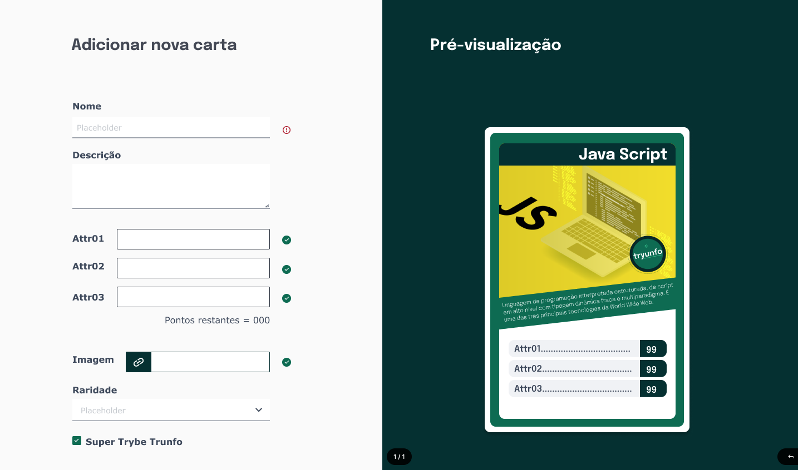

# Welcome to the Tryunfo project repository!

### README Translations:

-   [English](/README.en.md)
-   [Portuguese](/README.md)

* * *

## 👨‍💻 What was developed:

-   In this project I developed a game in the Super Trump style. By using this application a user is able to:

    -   Create a free-themed deck;

    -   Add and remove a card from the deck;

    -   View all cards that have been added to the deck;

    -   Play with the created deck.

:bulb:**See a sample below:**

## Skills Used:

-   Read the state of a component and use it to change what we display in the browser
-   Initialize a component, giving it a predefined state
-   Update the state of a component
-   Capture events using React syntax
-   Create forms using JSX syntax with the tags:`input`,`textarea`,`select`,`form`,`checkbox`
-   Pass information from child components to parent components via callbacks

# requirements

## 1. Create the form that will be used to add cards to the deck

Create a form that will be used to create the cards in your deck.

-   Create a component called`Form`inside from pasta`src/components`.

-   render the component`Form`inside the main component`App`.

-   

Crie os seguintes itens dentro do component <code>Form</code>:

    :bulb:**Tip:**You can create an input component. Remember to always have an associated label for each input.

    -   a field of type`text`that contains the attribute`data-testid="name-input"`. This field will be used to enter the name of the letter.

    -   a field of type`textarea`that contains the attribute`data-testid="description-input"`. This field will be used to enter the description of the letter.

    -   a field of type`number`that contains the attribute`data-testid="attr1-input"`. This field will be used to enter the first attribute of the letter. It is free for you to add the attribute that best matches your deck.

    -   a field of type`number`that contains the attribute`data-testid="attr2-input"`. This field will be used to enter the second attribute of the letter. It is free for you to add the attribute that best matches your deck.

    -   a field of type`number`that contains the attribute`data-testid="attr3-input"`. This field will be used to enter the third attribute of the letter. It is free for you to add the attribute that best matches your deck.

    -   a field of type`text`that contains the attribute`data-testid="image-input"`. This field will be used to enter the path to the image of the letter.

    -   a field of type`select`that contains the attribute`data-testid="rare-input"`. This field will be used to enter the rarity of the card and must have the`options`:`normal`,`raro`e`muito raro`(It is important that the options are in that order).

    -   a field of type`checkbox`that contains the attribute`data-testid="trunfo-input"`. This field will be used to enter whether the card is Super Trump.

    -   a`button`that contains the attribute`data-testid="save-button"`and that has the text "Save".
        

    

<strong>Imagem exemplo:</strong>

    

    
 

  
<strong>O que será verificado</strong>
 

-   It will be validated if there is a text input that has the`data-testid="name-input"`.

-   It will be validated if there is a textarea input that has the`data-testid="description-input"`.

-   It will be validated if there is an input number that has the`data-testid="attr1-input"`.

-   It will be validated if there is an input number that has the`data-testid="attr2-input"`.

-   It will be validated if there is an input number that has the`data-testid="attr3-input"`.

-   It will be validated if there is a text input that has the`data-testid="image-input"`.

-   It will be validated if there is a select input that has the`data-testid="rare-input"`with`options`:`normal`,`raro`e`muito raro`, in this order.

-   It will be validated if there is an input checkbox that has the`data-testid="trunfo-input"`.

-   It will be validated if there is a button that has the`data-testid="save-button"`.
    

* * *

## 2. Add the necessary props to the form component

-   

O componente <code>Form</code> deverá receber as seguintes props:

    -   `cardName`, a string;
    -   `cardDescription`, a string;
    -   `cardAttr1`, a string;
    -   `cardAttr2`, a string;
    -   `cardAttr3`, a string;
    -   `cardImage`, a string;
    -   `cardRare`, a string;
    -   `cardTrunfo`, um boolean;
    -   `hasTrunfo`, um boolean;
    -   `isSaveButtonDisabled`, um boolean;
    -   `onInputChange`, uma callback;
    -   `onSaveButtonClick`, uma callback;
        

-   

As props do componente <code>Form</code> deverão ser utilizadas conforme o indicado abaixo:

    -   Campo `name-input`: the property`value`must receive the value of the prop`cardName`e a prop`onChange`must receive the value of the prop`onInputChange`.

    -   Campo`description-input`: the property`value`must receive the value of the prop`cardDescription`e a prop`onChange`must receive the value of the prop`onInputChange`.

    -   Campo`attr1-input`: the property`value`must receive the value of the prop`cardAttr1`e a prop`onChange`must receive the value of the prop`onInputChange`.

    -   Campo`attr2-input`: the property`value`must receive the value of the prop`cardAttr2`e a prop`onChange`must receive the value of the prop`onInputChange`.

    -   Campo`attr3-input`: the property`value`must receive the value of the prop`cardAttr3`e a prop`onChange`must receive the value of the prop`onInputChange`.

    -   Campo`image-input`: the property`value`must receive the value of the prop`cardImage`e a prop`onChange`must receive the value of the prop`onInputChange`.

    -   Campo`rare-input`: the property`value`must receive the value of the prop`cardRare`e a prop`onChange`must receive the value of the prop`onInputChange`.

    -   Campo`trunfo-input`: the property`checked`must receive the value of the prop`cardTrunfo`e a prop`onChange`must receive the value of the prop`onInputChange`.

    -   Button`save-button`: the property`disabled`must receive the value of the prop`isSaveButtonDisabled`e a prop`onClick`must receive the value of the prop`onSaveButtonClick`.

        **:bulb: Obs:**for now the proposal`hasTrunfo`it hasn't been used yet, but don't worry, it will be used soon.

        
 

  
<strong>O que será verificado</strong>
 

-   Será validado se o campo de nome recebe o valor da prop `cardName`e se a callback`onInputChange`is called when the field undergoes some change.

-   It will be validated if the description field receives the value of the prop`cardDescription`e se a callback`onInputChange`is called when the field undergoes some change.

-   It will be validated if the field of attribute 1 receives the value of the prop`cardAttr1`e se a callback`onInputChange`is called when the field undergoes some change.

-   It will be validated if the field of attribute 2 receives the value of the prop`cardAttr2`e se a callback`onInputChange`is called when the field undergoes some change.

-   It will be validated if the field of attribute 3 receives the value of the prop`cardAttr3`e se a callback`onInputChange`is called when the field undergoes some change.

-   It will be validated if the image field receives the value of the prop`cardImage`e se a callback`onInputChange`is called when the field undergoes some change.

-   It will be validated if the rarity field receives the value of the prop`cardRare`e se a callback`onInputChange`is called when the field undergoes some change.

-   It will be valid if the Super Trump field receives the value of the prop`cardTrunfo`e se a callback`onInputChange`is called when the field undergoes some change.

-   It will be validated if the save button is enabled if the prop value`isSaveButtonDisabled`for`false`.

-   It will be validated if the save button is disabled if the prop value`isSaveButtonDisabled`for`true`.

-   It will be validated if the callback`onSaveButtonClick`is called when the button is clicked.
    

* * *

## 3. Create and render the Card component with the necessary props

-   

Crie um componente com o nome <code>Card</code> na pasta <code>src/components</code> e renderize-o  no componente principal <code>App</code>. O componente <code>Card</code> deve receber as seguintes props: 

    -   `cardName`, a string;
    -   `cardDescription`, a string;
    -   `cardAttr1`, a string;
    -   `cardAttr2`, a string;
    -   `cardAttr3`, a string;
    -   `cardImage`, a string;
    -   `cardRare`, a string;
    -   `cardTrunfo`, um boolean;
        

-   

Renderize o componente <code>Card</code> dentro do componente principal <code>App</code>:

    -   Display the value of the prop`cardName`. You can use any HTML tag that makes sense as long as it has the attribute`data-testid="name-card"`.

    -   Display the image using the HTML tag`img`, with the attribute`src`that has the value of the prop`cardImage`and the attribute`alt`with the value of the prop`cardName`. This image must also have the attribute`data-testid="image-card"`

    -   Display the value of the prop`cardDescription`. You can use any HTML tag that makes sense as long as it has the attribute`data-testid="description-card"`.

    -   Display the value of the prop`cardAttr1`. You can use any HTML tag that makes sense as long as it has the attribute`data-testid="attr1-card"`.

    -   Display the value of the prop`cardAttr2`. You can use any HTML tag that makes sense as long as it has the attribute`data-testid="attr2-card"`

    -   Display the value of the prop`cardAttr3`. You can use any HTML tag that makes sense as long as it has the attribute`data-testid="attr3-card"`.

    -   Display the value of the prop`cardRare`. You can use any HTML tag that makes sense as long as it has the attribute`data-testid="rare-card"`.

    -   display the text`Super Trunfo`only when the value of the prop`cardTrunfo`for`true`. You can use any HTML tag that makes sense as long as it has the attribute`data-testid="trunfo-card"`.

        **Tip: You can use conditional rendering to render or not render the super trump text.**

        

Imagem Exemplo:

 

  
<strong>O que será verificado</strong>
 
  
  - Será validado se o componente `data-testid="name-card"` é exibido e possui o valor da prop `cardName`.
  - Será validado se o componente `data-testid="image-card"` é exibido e possui o atributo `src` com o valor da prop `cardImage` e o atributo alt com o valor da prop `cardName`.
  - Será validado se o componente `data-testid="description-card"` é exibido e possui o valor da prop `cardDescription`.
  - Será validado se o componente `data-testid="attr1-card"` é exibido e possui o valor da prop `cardAttr1`.
  - Será validado se o componente `data-testid="attr2-card"` é exibido e possui o valor da prop `cardAttr2`.
  - Será validado se o componente `data-testid="attr3-card"` é exibido e possui o valor da prop `cardAttr3`.
  - Será validado se o componente `data-testid="rare-card"` é exibido e possui o valor da prop `cardRare`.
  - Será validado se o componente `data-testid="trunfo-card"` é exibido quando a prop `cardTrunfo` tiver o valor `true`.
  - Será validado se o componente `data-testid="trunfo-card"` **não** é exibido quando a prop `cardTrunfo` tiver o valor `false`.

* * *

## 4. Create the preview of the letter being created by the form

So far you have created two components that receive`props`, now it's time to create the state of the components.
The components`Form`e`Card`will share the same state to display the same information (that already gives you a hint of where the state should be, doesn't it?).
When some information is typed in a field of the form, the component`Card`must display the same information in real time, creating a preview of the card before it is saved in the deck (the saving functionality will be done in the next requirements).

You must use the prop`onInputChange`to pass a callback to handle the events of`onChange`of the form inputs. Don't forget that input values ​​(which are also passed by props) must also be saved in a state.

**:bulb: I mean:**the same state used to control form inputs can be passed to the component`Card`.

<strong>Informações técnicas:</strong>

-   When typing something in the field with the`data-testid="name-input"`of the form, the same value should be rendered in the component`Card`, in the element with the`data-testid="name-card"`.

-   When typing something in the field with the`data-testid="description-input"`of the form, the same value should be rendered in the component`Card`, in the element with the`data-testid="description-card"`.

-   When typing something in the field with the`data-testid="image-input"`of the form, the same value must be passed to the component`Card`, and be used in the attribute`src`of the element with the`data-testid="image-card"`.

-   When typing something in the field with the`data-testid="attr1-input"`of the form, the same value should be rendered in the component`Card`, in the element with the`data-testid="attr1-card"`.

-   When typing something in the field with the`data-testid="attr2-input"`of the form, the same value should be rendered in the component`Card`, in the element with the`data-testid="attr2-card"`.

-   When typing something in the field with the`data-testid="attr3-input"`of the form, the same value should be rendered in the component`Card`, in the element with the`data-testid="attr3-card"`.

-   When selecting a value in the`select`as`data-testid="rare-input"`of the form, the same value should be rendered in the component`Card`, in the element with the`data-testid="rare-card"`.

-   When the type field`checkbox`who owns the`data-testid="trunfo-input"`you are`checked`, should be rendered in the component`Card`the text`Super Trunfo`inside the element with the`data-testid="trunfo-card"`.

    **:bulb: I mean:**for fields that need a default value (like the rarity field for example) you can start the state already with that value.

    

    
 

  
<strong>O que será verificado</strong>
 

-   It will be validated if the value entered in the form name input is rendered in the preview of the letter.
-   It will be validated if the value entered in the form's Description input is rendered in the preview of the letter.
-   It will be validated if the value entered in the input referring to attribute 1 in the form is rendered in the preview of the letter.
-   It will be validated if the value entered in the input referring to attribute 2 in the form is rendered in the preview of the letter.
-   It will be validated if the value entered in the input referring to attribute 3 in the form is rendered in the preview of the letter.
-   It will be validated if it is rendered in the preview of the letter the`data-testid="trunfo-card"`if the Super Trump checkbox is selected.
    

* * *

## 5. Validate the Save button on the form

O botão que possui o atributo <code>data-testid="save-button"</code> só deve estar habilitado se todas as informações do formulário estiverem preenchidas corretamente, seguindo as seguintes regras:

-   The fields`Nome`,`Descrição`,`Imagem`e`Raridade `must contain some information (i.e. the`inputs`cannot be empty).

-   The sum of the values ​​of the 3 attributes (`attr1-input`,`attr2-input`e`attr3-input`) cannot exceed the value**210**.

-   Each of the three attributes can have**maximum 90 points each**.

-   Attributes cannot be assigned negative values.
    
 

  
<strong>O que será verificado</strong>
 

-   It will be validated if the button`salvar`is disabled when the page is first rendered.
-   It will be validated if the button`salvar`is disabled if the name field is empty.
-   It will be validated if the button`salvar`is disabled if the image field is empty.
-   It will be validated if the button`salvar`is disabled if the description field is empty.
-   It will be validated if the button`salvar`is disabled if attribute 1 field is greater than 90.
-   It will be validated if the button`salvar`is disabled if the field of attribute 1 is less than 0.
-   It will be validated if the button`salvar`is disabled if attribute 2 field is greater than 90.
-   It will be validated if the button`salvar`is disabled if attribute 2 field is less than 0.
-   It will be validated if the button`salvar`is disabled if attribute 3 field is greater than 90.
-   It will be validated if the button`salvar`is disabled if attribute 3 field is less than 0.
-   It will be validated if the button`salvar`is disabled if the sum of attribute fields is greater than 210.
-   It will be validated if the button`salvar`is enabled by filling in all form fields correctly.
    

* * *

## 6. Create the save button function

Agora que o botão de salvar já está validado, você pode adicionar uma nova carta ao seu baralho. Isso significa que você precisará criar um novo estado na sua aplicação para salvar a lista de cartas existentes no seu baralho.

:bulb:**Tip:**you can save each letter in an object format and have a_array_with these objects in their state.

-   By clicking on the button that has the attribute`data-testid="save-button"`, the information that was filled in the form should be saved in the state of your application.

-   After saving the information, the`inputs`of the form`Nome`,`Descrição`e`Imagem`and the contents of the letter preview should be cleaned up.

-   After saving the information, the three attribute fields must have a value of 0.

-   After saving the information, the field`Raridade`must contain the value`normal`.
    
 

  
<strong>O que será verificado</strong>
 

-   It will be validated if the form fields`Nome`,`Descrição`e`Imagem`are cleared after clicking`salvar`.

-   It will be validated if the three attribute fields have the value`0`after clicking`salvar`.

-   It will be validated if the field of`Raridade`has the value`normal`after clicking`salvar`.
    

* * *

## 7. Create the Super Trump validation

Em um baralho de Super Trunfo pode existir apenas <strong>uma carta Super Trunfo</strong>. Por isso é necessário fazer uma validação para que somente 1 carta Super Trunfo seja salva no seu baralho:

-   In order for a card to be saved as a Super Trump, the input with the`data-testid="trunfo-input"`is`checked`when saving the letter. Therefore, validation will be done in this field. To do this validation you must use the prop`hasTrunfo`of the component`Form`.

-   If there is already a Super Trump card in your deck, the card creation form should not display the`checkbox``data-testid="trunfo-input"`. In its place should be rendered the phrase: "You already have a Super Trump in your deck".

    **Tip: Remember to use conditional rendering (in the[:convenience store: Development](#orientações)) of React in this requirement.**

    
 

  
<strong>O que será verificado</strong>
 

-   It will be validated if the Super Trump checkbox is rendered when loading the page.

-   It will be validated if the text "You already have a Super Trump in your deck" is rendered if there is already a Super Trump card in the deck.
    

* * *

## 8. Display the list of cards that are saved in the state

You already have a lot of cool cards in your deck, now it's time to list them so you can see your entire collection!

-   Renderize dentro do component`App`a list with all the cards you have in the application state.
-   Ensure that whenever a card is added, the list is automatically updated.

:bulb:**Tip:**you can reuse the component`Card`in that requirement. :bulb:

Imagem Exemplo:

 

  
<strong>O que será verificado</strong>
 

-   It will be validated if the letter is rendered on the page when saving it.
-   It will be validated if the list is automatically updated when a letter is added.
    

* * *

## 9. Create a button to remove a card from the deck

-   

Criar em cada carta que está sendo renderizada do seu baralho um <code>button</code> com o texto <code>Excluir</code> e o atributo <code>data-testid="delete-button"</code>.

    -   to letter of_preview_**can't have this button**.
    -   By clicking this button, the card must be deleted from your deck, that is, it must no longer be rendered on the page.**Tip: Remember that the deck is being rendered from the state of your component!**
    -   If the deleted card is a Super Trump card, the`checkbox`of the form should appear again, making it possible to create a new Super Trump card.

        

        

  
<strong>O que será verificado</strong>
 

-   It will be validated if the button`Excluir`is rendered on-screen only on cards added to the deck.
-   It will be validated if when adding a card and then deleting it, the card is not rendered.
-   It will be validated if when adding two cards and then deleting one, the card is not rendered.
-   It will be validated if when deleting a Super Trump card, the checkbox in the form is rendered again.
    

* * *

# bonus requirements

Your application will have three card listing filters: filter by**Name**, by**rarity**and for**Super Trunfo**. the filters**Name**e**rarity**are cumulative. the filter**Super Trunfo**works independently.

## 10. Create the filter by letter name

Para filtro do <strong>nome</strong>, você deverá criar um campo do tipo <code>text</code> e adicionar o atributo <code>data-testid="name-filter"</code>:

  
  * Este campo deve ser renderizado sempre, mesmo se não existirem cartas salvas no baralho.
  
  * Ao digitar neste campo, deve ser renderizado na página apenas as cartas que contenham no `nome` o texto digitado.

 

  
<strong>O que será verificado</strong>
 

-   It will be validated if the filter field by name renders on the screen.
-   It will be validated if only matching cards appear after the filter.
-   It will be validated if it does not render any cards if there is no matching name.
    

* * *

## 11. Create the filter by card rarity

Para filtrar por <strong>raridade</strong>, você deverá criar um campo do tipo <code>select</code> e adicionar o atributo <code>data-testid="rare-filter"</code>:

  
  * Este `select` deve possuir as seguintes `options`: 
    - `todas`
    - `normal`
    - `raro`
    - `muito raro`
  
  * Por padrão, a opção `todas` já estará selecionada;
  
  * Ao selecionar uma das opções, apenas as cartas que possuem a raridade especificada deverão ser renderizadas. Caso esteja selecionada `todas`, não deve ter filtro de raridade aplicado na lista.
  
  * Se o campo do filtro `Nome` estiver preenchido, os dois filtros (por nome e por raridade) devem funcionar em conjunto.

 

  
<strong>O que será verificado</strong>
 

-   It will be validated if the filter field by Rarity renders on the screen.
-   It will be validated if only cards with rarity`normal`are displayed after the filter.
-   It will be validated if only cards with rarity`raro`are displayed after the filter.
-   It will be validated if only cards with rarity`muito raro`are displayed after the filter.
-   It will be validated if all cards are displayed when the rarity filter is with the option`todas`selected.
-   It will be validated if it does not render any cards if there is no corresponding rarity.
    

* * *

## 12. Create the Super Trump filter

Para filtrar por <strong>Super Trunfo</strong>, você deverá criar um campo do tipo <code>checkbox</code> com a <code>label</code> Super Trunfo e o atributo <code>data-testid="trunfo-filter"</code>:

  
  * Ao selecionar este `checkbox`, apenas a carta **Super Trunfo** deverá ser renderizada.
  
  * Enquanto o `checkbox` estiver com o atributo `checked`, ou seja, se estiver selecionado, os `inputs` dos filtros por nome e por raridade deverão ficar com o atributo `disabled`.

-   In o`checkbox`is not selected, the cards should be rendered normally, following only the rules of the previous filters.

    

    
 

  
<strong>O que será verificado</strong>
 
  - Será validado se somente a carta de super trunfo é exibida quando esse filtro é selecionado.

* * *

# non-evaluative requirements

You have already created your Tryunfo deck. Now you can create a feature to play with other students! Below we will present a**suggestion**of how this functionality can be created!**These requirements will not be evaluated by the Evaluator**, so feel free to develop as you see fit! Use the knowledge you have learned and developed over the previous modules and exercise your creativity!

<strong>Regras do Jogo</strong>

Before starting development, let's remember how the game works:

-   First, each person must "take" a random card from their deck.
-   The first person will choose an attribute to compare with the other person's card. Remember that in Tryunfo the attributes can have different names in each deck, so the ideal is to be based on the attribute position, that is, compare the first attribute of your card with the first attribute of the rival person's card.
-   Whoever has the highest number in the chosen attribute wins the round.
-   At the end of the round, each person must "take" a new random card.
-   Each round, the turn of who chooses the attribute for comparison is alternated.
    
 

<strong>O que será necessário</strong>

To be able to play, you will need to have developed the following steps:

1) Create deck with N cards (already developed in previous requirements).
   2) Create a function that shuffles the cards and renders the first card in the deck.
   3) Create a button to render the next card in the deck.
   4) On the last card, have a button to restart the game, shuffling again.

* * *

## 13. Start the game

-   Create a button with the text`Jogar`;

-   Create a new state in your application, which will receive the cards from your deck in random order;

-   By clicking the button`Jogar`, this new state should receive the cards that are saved in your deck, but in order**Random**see this link[how to implement a function that shuffles an array](https://flaviocopes.com/how-to-shuffle-array-javascript/).

-   Create a new state in your application that will control the position in the array of the card that will be rendered.

-   To render on the page, you can use**conditional rendering**to show the card only when a game is in progress.

    **Remember that there are several possible ways to set up this function. This is just a suggestion.**

* * *

## 14. Create Next Letter button

-   After clicking`Jogar`and shuffle the existing cards, display the first card on the screen, i.e. the card that is in position`0`do array.

-   Display a button with the text`Próxima carta`.

-   By clicking the "Next card" button, the next card in your "shuffled" deck should be rendered. You can use the state created in the previous requirement and increment it each round.

Imagem Exemplo:

* * *

## 15. Restart the game

-   When the last card in the deck is being rendered, i.e. when you are in the last position of the shuffled array of cards, the "Next card" button should not be rendered on the screen.

-   A new button should appear with the text`Embaralhar cartas`.

-   By clicking the button`Embaralhar cartas`the deck must be shuffled again and the state controlling the position of the displayed card must be`0`again.

Imagem Exemplo:

* * *
